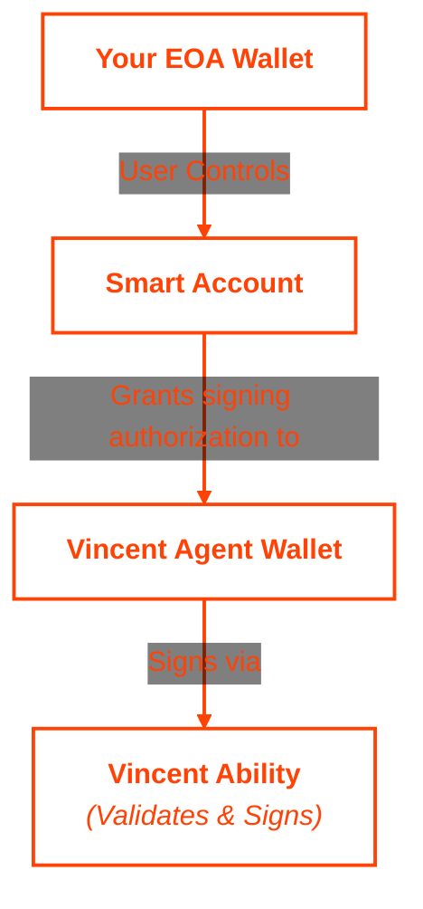

The Aave Gated Signer Ability enables Vincent Apps to validate and sign both EOA transactions and [ERC-4337](https://eips.ethereum.org/EIPS/eip-4337) UserOperations for Aave protocol interactions on behalf of Vincent Users. This ability provides secure, delegated signing with comprehensive validation, ensuring that all operations benefit the user and interact only with authorized Aave contracts.

## Key Features

- **EOA transactions support**: Validates and signs transactions using the Agent's Wallet PKP
- **Smart Account Integration**: Validates and signs UserOperations (ERC-4337) for Smart Accounts leveraging their own delegation systems
- **Standard or EIP-712 Signatures**: Can generate both standard signatures and EIP-712 signatures based on the provided operation
- **Comprehensive Validation**: Decodes, simulates, and validates all operations on-chain before signing
- **Aave Protocol Safety**: Ensures interactions only occur with authorized Aave contracts (Pool, tokens, etc.)
- **User Protection**: Verifies operations benefit the user with no value extraction
- **Multi-Chain Support**: Works across networks where Aave V3 is deployed (Ethereum, Base, Arbitrum, etc.)

## How It Works

The Aave Gated Signer Ability is built using the Vincent Ability SDK and operates in two phases:

<Steps>
  <Step title="Precheck Phase">
    Validates the Transaction or UserOperation without executing it:

    - Decodes the UserOperation calldata to understand the transaction
    - Simulates the transaction on-chain (read-only) to see effects
    - Validates all contract interactions are with authorized Aave addresses
    - Verifies no value is being extracted from the user and there are no unauthorized interactions
    - Checks operations align with Aave's intended use (supply, borrow, repay, withdraw)
    - Returns validation results without modifying blockchain state
  </Step>

  <Step title="Execution Phase">
    Performs the same validations as precheck, then signs the UserOperation:

    - Repeats all validation checks from the precheck phase
    - Signs the UserOperation with the Agent Wallet if all checks pass
    - Returns the Transaction or UserOperation signature
    - The signature can be added to the Transaction or UserOperation and broadcasted to the network
  </Step>
</Steps>

## Getting Started

Depending on your role in the Vincent Ecosystem, you'll be interacting with this Ability in different ways. Click on the link below that matches your role to see how to get started:

- **Vincent App Developers**: If you're building a Vincent App that needs gated signing integration with Aave, go [here](#adding-the-ability-to-your-vincent-app).
- **Vincent App Delegatees**: If you're executing this ability on behalf of Vincent App Users, go [here](#executing-the-ability-as-a-vincent-app-delegatee).

## Adding the Ability to your Vincent App

If you want to enable your App Delegatees to validate and sign Aave interactions on behalf of your Vincent App Users, you can add this Ability to your App.

Adding Abilities to your Vincent App is done using the [Vincent App Dashboard](https://dashboard.heyvincent.ai/). Visit the [Creating an App](/app/creating-an-app) guide to learn more about how to add Abilities to your App during creation, or check out the [Updating Your App](/app/updating-apps) guide to learn how to add Abilities to an existing App.

## Executing the Ability as a Vincent App Delegatee

Before executing Aave operations, the following conditions must be met:

- **PKP Setup**: If the user is using their agent PKP directly then no further setup is needed

- **Smart Account Setup**: If using a smart account, the user must have an ERC-4337 compatible Smart Account (e.g., ZeroDev Kernel, Safe)

- **Signer Permission**: The Agent Wallet must be granted some form of valid signature permissions on the Smart Account

- **Valid UserOperation**: The backend service must construct a complete Transaction or UserOperation, depending on the case, containing interactions with the Aave protocol

- **Funds for gas**: If using a paymaster, ensure proper paymaster data is included in the UserOperation. If not, ensure the smart account or the PKP have enough funds to pay for gas

<Info>
To learn more about executing Vincent Abilities, see the [Executing Abilities](/ability/explaining-abilities) guide.
</Info>

### Smart Account Architecture

The typical flow involves multiple components:

<div align="center">



</div>

Learn more about Smart Accounts in the [Smart Accounts concept guide](/smart-account/introduction/about).

### Executing the `precheck` Function

This Ability's `precheck` function validates the Transaction or UserOperation without actually signing it, allowing you to verify the operation will be accepted before committing to execution.

<Tabs>
  <Tab title="Parameters">
    Before executing the `precheck` function, you'll need to provide the following parameters:

    ```typescript
    // For Smart Accounts (UserOperation)
    {
      /**
       * The unsigned UserOperation for the Smart Account (ERC-4337 v0.7.0 format)
       */
      userOp: {
        sender: string;                           // Smart Account address (hex)
        nonce: string;                            // Account nonce (hex string, e.g., "0x1")
        callData: string;                         // Encoded transaction calls (hex)
        callGasLimit: string;                     // Gas limit for execution (hex)
        verificationGasLimit: string;             // Gas for verification (hex)
        preVerificationGas: string;               // Pre-verification gas (hex)
        maxFeePerGas: string;                     // Max fee per gas (hex, default: "0x59682F00")
        maxPriorityFeePerGas: string;             // Priority fee (hex, default: "0x3B9ACA00")
        signature?: string;                       // Can be empty

        // ERC-4337 v0.7.0 Paymaster fields (separate, not combined)
        paymaster?: string;                       // Paymaster address (hex)
        paymasterData?: string;                   // Paymaster-specific data (hex)
        paymasterVerificationGasLimit: string;    // Paymaster verification gas (hex)
        paymasterPostOpGasLimit: string;          // Paymaster post-op gas (hex)

        // Account deployment fields (if account not yet deployed)
        factory?: string;                         // Account factory address (hex)
        factoryData?: string;                     // Factory deployment data (hex)
      };
      /**
       * EntryPoint contract address for UserOperation validation. Defaults to v0.7.0.
       */
      entryPointAddress?: string;
      /**
       * The Alchemy RPC URL for on-chain simulation and validation
       */
      alchemyRpcUrl: string;

      // Optional fields for Safe Smart Accounts
      validAfter?: number;                        // Valid after timestamp (Safe)
      validUntil?: number;                        // Valid until timestamp (Safe)
      safe4337ModuleAddress?: string;             // Safe 4337 Module address
      eip712Params?: {                            // EIP-712 signing parameters (Safe)
          domain: {
            chainId: number;
            verifyingContract: string;
          };
          types: Record<string, Array<{ name: string; type: string }>>;
          primaryType: string;
      };
    }

    // OR

    // For EOA Transactions
    {
      /**
       * The transaction object to simulate and validate
       */
      transaction: {
        to: string;
        data: string;
        value: string; // Hex string
        // other transaction fields
      };
      /**
       * The Alchemy RPC URL for on-chain simulation and validation
       */
      alchemyRpcUrl: string;
    }
    ```

    **Important Notes:**
    - **v0.7.0 Format**: This ability uses ERC-4337 v0.7.0 which has separate paymaster fields (not `paymasterAndData`)
    - **Hex Strings**: All numeric values must be hex strings (e.g., `"0x1"`), not bigints or numbers. You can use the toVincentUserOperation method to serialize a UserOperation
    - **EntryPoint**: Must be a valid EntryPoint v0.7 address for your target network
    - The `callData` field must contain valid Aave protocol interactions
  </Tab>

  <Tab title="Implementation">
    To execute `precheck`, you'll need to:

    - Create an instance of the `VincentAbilityClient` using the `getVincentAbilityClient` function (imported from `@lit-protocol/vincent-app-sdk/abilityClient`)
      - Pass in the Ability's `bundledVincentAbility` object (imported from `@lit-protocol/vincent-ability-aave`)
      - Pass in the `ethersSigner` you'll be using to sign the request to Lit with your Delegatee private key
    - Construct a valid Transaction or UserOperation with Aave interactions
    - Use the `VincentAbilityClient` instance to call the `precheck` function

    ```typescript
    import { getVincentAbilityClient } from '@lit-protocol/vincent-app-sdk/abilityClient';
    import { bundledVincentAbility } from '@lit-protocol/vincent-ability-aave';

    // Create ability client
    const abilityClient = getVincentAbilityClient({
      bundledVincentAbility,
      ethersSigner: yourEthersSigner,
    });

    // Example: Validate UserOperation for Aave interaction
    const smartAccountParams = {
      userOp: {
        sender: '0x1234...', // Smart Account address
        nonce: '0x1', // Hex string, not bigint
        callData: '0x...', // Encoded Aave operation calldata
        callGasLimit: '0x30D40', // 200000 in hex
        verificationGasLimit: '0x186A0', // 100000 in hex
        preVerificationGas: '0xC350', // 50000 in hex
        maxFeePerGas: '0x59682F00', // Default: 1.5 gwei
        maxPriorityFeePerGas: '0x3B9ACA00', // Default: 1 gwei
        signature: '0x', // Empty for precheck

        // v0.7.0 paymaster fields (if using paymaster)
        paymaster: '0x5678...', // Optional: Paymaster address
        paymasterData: '0x...', // Optional: Paymaster data
        paymasterVerificationGasLimit: '0x186A0', // Optional
        paymasterPostOpGasLimit: '0xC350', // Optional
      },
      entryPointAddress: '0x0000000071727De22E5E9d8baF0edAc6f37da032', // EntryPoint v0.7
      alchemyRpcUrl: 'https://base-sepolia.g.alchemy.com/v2/YOUR_API_KEY',
    };

    const precheckResult = await abilityClient.precheck(smartAccountParams, {
      delegatorPkpEthAddress: '0x...', // Agent Wallet address
    });

    if (precheckResult.success) {
      console.log('Validation passed');
      // Result contains simulation changes and validated userOp
      const { simulationChanges } = precheckResult.result;
      console.log('Simulation changes:', simulationChanges);
    } else {
      // Handle different types of failures
      if (precheckResult.runtimeError) {
        console.error('Runtime error:', precheckResult.runtimeError);
      }
      if (precheckResult.schemaValidationError) {
        console.error('Schema validation error:', precheckResult.schemaValidationError);
      }
      if (precheckResult.result) {
        console.error('Validation failed:', precheckResult.result.error);
      }
    }
    ```
  </Tab>

  <Tab title="Response">
    **Success Response**

    A successful `precheck` response will contain:

    ```typescript
    {
      /**
       * Simulated asset changes the UserOperation will make
       */
      simulationChanges: Array<{
        assetType: 'NATIVE' | 'ERC20' | 'ERC721' | 'ERC1155' | 'SPECIAL_NFT';
        changeType: 'APPROVE' | 'TRANSFER';
        from: string;              // Address sending the asset
        to: string;                // Address receiving the asset
        rawAmount?: string | null; // Raw token amount
        amount?: string | null;    // Formatted amount
        contractAddress?: string | null; // Token contract address
        tokenId?: string | null;   // NFT token ID (if applicable)
        decimals: number;          // Token decimals
        symbol: string;            // Token symbol (e.g., "USDC")
        name?: string | null;      // Token name
        logo?: string | null;      // Token logo URL
      }>;
    }
    ```

    **Failure Response**

    A failure `precheck` response will contain:

    ```typescript
    {
      /**
       * Error message describing why validation failed
       */
      error: string;
    }
    ```

    **Notes:**
    - `simulationChanges` shows exactly what asset transfers/approvals will occur
    - Uses Alchemy's RPC for simulation and chain definition
    - Validation ensures all interactions are with authorized Aave contracts
  </Tab>
</Tabs>

<Warning>
**Alchemy RPC Required**: This ability requires an Alchemy RPC URL for the desired chain. It uses Alchemy's proprietary methods for on-chain simulation. Execution will fail if a non-Alchemy RPC URL is provided.
</Warning>

### Executing the `execute` Function

This Ability's `execute` function performs the same validation as precheck, then signs the UserOperation or Transaction with the Agent Wallet. The signature can be over an eoa transaction, a standard user operation or an EIP-712 message based on the user operation.

<Tabs>
  <Tab title="Parameters">
    The `execute` function requires the same parameters as `precheck`:

    ```typescript
    // For Smart Accounts (UserOperation)
    {
      /**
       * The unsigned UserOperation for the Smart Account (ERC-4337 v0.7.0 format)
       */
      userOp: {
        sender: string;                           // Smart Account address (hex)
        nonce: string;                            // Account nonce (hex string, e.g., "0x1")
        callData: string;                         // Encoded transaction calls (hex)
        callGasLimit: string;                     // Gas limit for execution (hex)
        verificationGasLimit: string;             // Gas for verification (hex)
        preVerificationGas: string;               // Pre-verification gas (hex)
        maxFeePerGas: string;                     // Max fee per gas (hex, default: "0x59682F00")
        maxPriorityFeePerGas: string;             // Priority fee (hex, default: "0x3B9ACA00")
        signature?: string;                       // Can be empty

        // ERC-4337 v0.7.0 Paymaster fields (separate, not combined)
        paymaster?: string;                       // Paymaster address (hex)
        paymasterData?: string;                   // Paymaster-specific data (hex)
        paymasterVerificationGasLimit: string;    // Paymaster verification gas (hex)
        paymasterPostOpGasLimit: string;          // Paymaster post-op gas (hex)

        // Account deployment fields (if account not yet deployed)
        factory?: string;                         // Account factory address (hex)
        factoryData?: string;                     // Factory deployment data (hex)
      };
      /**
       * EntryPoint contract address for UserOperation validation. Defaults to v0.7.0.
       */
      entryPointAddress?: string;
      /**
       * The Alchemy RPC URL for on-chain simulation and validation
       */
      alchemyRpcUrl: string;

      // Optional fields for Safe Smart Accounts
      validAfter?: number;                        // Valid after timestamp (Safe)
      validUntil?: number;                        // Valid until timestamp (Safe)
      safe4337ModuleAddress?: string;             // Safe 4337 Module address
      eip712Params?: {                            // EIP-712 signing parameters (Safe)
          domain: {
            chainId: number;
            verifyingContract: string;
          };
          types: Record<string, Array<{ name: string; type: string }>>;
          primaryType: string;
      };
    }

    // OR

    // For EOA Transactions
    {
      /**
       * The transaction object to simulate and validate
       */
      transaction: {
        to: string;
        data: string;
        value: string; // Hex string
        // other transaction fields
      };
      /**
       * The Alchemy RPC URL for on-chain simulation and validation
       */
      alchemyRpcUrl: string;
    }
    ```
  </Tab>

  <Tab title="Implementation">
    The `execute` function can be called using the same `VincentAbilityClient` instance:

    ```typescript
    // Add the serialized session key to the parameters
    const executeParams = {
      userOp: smartAccountParams.userOp,
      entryPointAddress: smartAccountParams.entryPointAddress,
      alchemyRpcUrl: smartAccountParams.rpcUrl,
    };

    const executeResult = await abilityClient.execute(executeParams, {
      delegatorPkpEthAddress: '0x...', // Agent Wallet address
    });

    if (executeResult.success) {
      const { simulationChanges, signature } = executeResult.result;

      console.log('Signed successfully');
      console.log('Signature:', signature);
      console.log('Simulation changes:', simulationChanges);

      const userOp = {
      ...smartAccountParams.userOp,
        signature,
      };

      // Now broadcast the signed UserOperation via your bundler
      const txHash = await bundler.sendUserOperation(userOp);
      console.log('Transaction hash:', txHash);
    } else {
      // Handle different types of failures
      if (executeResult.runtimeError) {
        console.error('Runtime error:', executeResult.runtimeError);
      }
      if (executeResult.schemaValidationError) {
        console.error('Schema validation error:', executeResult.schemaValidationError);
      }
      if (executeResult.result) {
        console.error('Signing failed:', executeResult.result.error);
      }
    }
    ```
  </Tab>

  <Tab title="Response">
    **Success Response**

    A successful `execute` response will contain the same structure as `precheck`, but will add the requested signature:

    ```typescript
    {
      /**
       * Simulated asset changes the UserOperation will make
       */
      simulationChanges: Array<{
        assetType: 'NATIVE' | 'ERC20' | 'ERC721' | 'ERC1155' | 'SPECIAL_NFT';
        changeType: 'APPROVE' | 'TRANSFER';
        from: string;
        to: string;
        rawAmount?: string | null;
        amount?: string | null;
        contractAddress?: string | null;
        tokenId?: string | null;
        decimals: number;
        symbol: string;
        name?: string | null;
        logo?: string | null;
      }>;
      /**
       * The Transaction or UserOperation signature by the PKP
       */
      signature: string;
    }
    ```

    **Failure Response**

    A failure `execute` response will contain:

    ```typescript
    {
      /**
       * Error message describing why signing failed
       */
      error: string;
    }
    ```

    **Notes:**
    - The response structure is identical to `precheck`, except `signature` being added
    - The signature can be added to the Transaction or UserOperation to be broadcasted
    - `simulationChanges` provides the same asset change information
  </Tab>
</Tabs>

## Supported Networks

This ability supports Aave V3 operations on networks where it, and the used smart account if used, are available:

| Network Type | Supported Chains |
|--------------|------------------|
| **Mainnets** | `ethereum`, `polygon`, `arbitrum`, `optimism`, `base`, `avalanche` |
| **Testnets** | `sepolia`, `basesepolia`, `arbitrumsepolia`, `optimismsepolia` |

<Note>
Network support is limited by Alchemy's `alchemy_simulateUserOperationAssetChanges` API. Only networks where Alchemy supports UserOperation simulation can be used with this ability.
</Note>

## Important Considerations

<AccordionGroup>
  <Accordion title="Smart Account Compatibility" icon="puzzle-piece">
    This ability works with ERC-4337 compliant Smart Accounts. Ensure your Smart Account implementation follows the standard and has proper support to define the PKP as a valid signer.
  </Accordion>

  <Accordion title="Validation Strictness" icon="shield-check">
    The ability validates that ALL interactions are with authorized Aave contracts. Any unauthorized contract call will cause validation to fail. This is a security feature to prevent malicious operations.
  </Accordion>

  <Accordion title="On-Chain Simulation" icon="flask">
    Operations are simulated on-chain before signing. This means the ability must connect to an actual blockchain node. Ensure proper RPC access for the target network.
  </Accordion>

  <Accordion title="Gas Estimation" icon="gas-pump">
    Smart Account operations typically require more gas than regular transactions due to verification logic. Ensure gas limits are properly estimated and sufficient funds exist (or paymaster is configured).
  </Accordion>

  <Accordion title="UserOperation Construction" icon="code">
    Constructing valid UserOperations requires understanding ERC-4337. Consider using Smart Account SDKs (ZeroDev, Biconomy, etc.) to generate properly formatted UserOperations.
  </Accordion>

  <Accordion title="Operation Completeness" icon="code">
    The ability does not modify the received Transaction or UserOperation, so any change made to it after getting the signature will invalidate it. Ensure you are sending the complete operation to the ability.
  </Accordion>
</AccordionGroup>

## Error Handling

<AccordionGroup>
  <Accordion title="Common Failure Scenarios" icon="bug">
    - **Invalid UserOperation Format**: Malformed UserOperation structure or missing required fields
    - **Unauthorized Contract Interaction**: UserOperation contains calls to non-Aave contracts
    - **Simulation Failure**: On-chain simulation reverts or fails
    - **Value Extraction Detected**: Operation attempts to extract value from the user
    - **Permission Not Configured**: Agent Wallet lacks signing permissions on Smart Account
    - **Insufficient Gas Limits**: Gas limits too low for the operation complexity
    - **Invalid Chain**: Chain not supported or RPC unavailable
    - **Aave Contract Mismatch**: Operation targets non-Aave addresses
  </Accordion>

  <Accordion title="Security Validations" icon="shield-halved">
    This ability performs extensive security checks:
    - **Contract Allowlist**: Only Aave protocol contracts are permitted
    - **Simulation Required**: All operations must pass on-chain simulation
    - **No Value Extraction**: ETH/token transfers out of user control are blocked
    - **Signature Verification**: Signing permissions are validated

    If any security check fails, the operation is rejected before signing.
  </Accordion>
</AccordionGroup>

## Learn More

<Columns cols={3}>
  <Card title="Smart Accounts" icon="microchip" href="/smart-account/introduction/about" color="#FF4205">
    Learn about Smart Account architecture with Vincent
  </Card>
  <Card title="Agent Wallets" icon="wallet" href="/concepts/wallets/agent-wallets" color="#FF4205">
    Understand how Agent Wallets enable delegation
  </Card>
</Columns>
