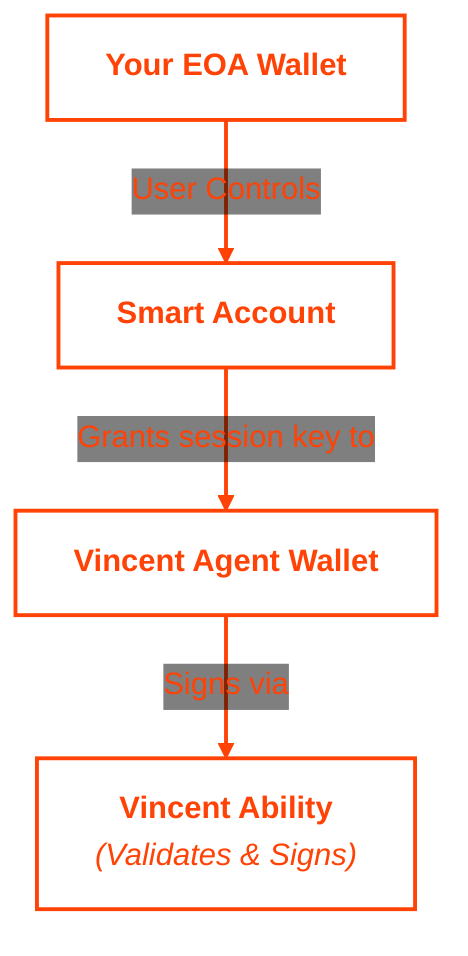

Smart Accounts are programmable blockchain accounts that enable advanced transaction patterns beyond traditional wallet capabilities. When integrated with Vincent, Smart Accounts allow you to delegate signing authority to Agent Wallets with built-in safety validation, unlocking powerful automation while maintaining full control over your assets.

## Key Features

- **Programmable Security:** Execute complex transaction logic with custom validation rules enforced at the account level
- **Session Key Delegation:** Grant limited signing authority to Agent Wallets without exposing your primary keys
- **Gasless Transactions:** Enable paymasters to sponsor transaction fees, removing gas barriers for users
- **Batch Operations:** Combine multiple transactions into a single atomic operation for efficiency
- **Advanced Recovery:** Implement flexible account recovery mechanisms beyond traditional seed phrases
- **Policy Enforcement:** All operations validated through Vincent abilities before execution

## How Smart Accounts Work with Vincent

1. **You create a Smart Account** using a provider like [ZeroDev](https://zerodev.app/), [Biconomy](https://biconomy.io/), or [Safe](https://safe.global/), with your EOA wallet as the owner, establishing programmable control over your on-chain assets.

2. **You grant session key permissions** to your Agent Wallet, allowing it to sign specific types of transactions on behalf of your Smart Account within defined boundaries and time limits.

3. **Your backend service constructs operations** that your Smart Account should perform, such as DeFi interactions, token swaps, or cross-chain transfers, formatted as [ERC-4337](https://eips.ethereum.org/EIPS/eip-4337) UserOperations.

4. **Vincent abilities validate operations** by decoding the transactions, simulating them on-chain, and verifying they only interact with authorized contracts and benefit you as the user.

5. **Agent Wallet signs validated operations** using the session key permission, creating a signed UserOperation that can be broadcast to the network through a bundler.

6. **The Smart Account executes the operation** on-chain, with all validation logic enforced at both the Vincent ability level and the Smart Account contract level.

## Architecture Overview

## Security Model

Traditional automation approaches require backend services to hold your private keys, creating custody risk and regulatory complexity. Smart Accounts with Vincent eliminate this risk:

- **No Key Custody:** Your keys never leave your control—Vincent uses session key delegation instead of taking custody
- **Transparent Validation:** All validation logic is auditable in Vincent abilities running in Lit's Trusted Execution Environment (TEE)
- **Pre-Signing Verification:** Transactions are simulated on-chain before signing to ensure expected behavior and prevent malicious operations

## Supported Networks

Smart Accounts with Vincent work on any network where:
- ERC-4337 infrastructure is deployed (bundlers, entry points)
- Your Smart Account provider supports the network
- Vincent abilities are available for your desired operations
- Alchemy's `alchemy_simulateUserOperationAssetChanges` API supports the network (required for transaction simulation)

Currently supported networks include Ethereum, Base, Arbitrum, Optimism, Polygon, Avalanche, and their testnets.

## Popular Smart Account Providers

<Columns cols={3}>
  <Card title="ZeroDev Kernel" icon="cube" href="https://zerodev.app/" color="#FF4205">
    Modular smart account with plugin architecture and advanced features
  </Card>
  <Card title="Safe" icon="shield" href="https://safe.global/" color="#FF4205">
    Industry-standard multi-signature smart account with extensive ecosystem support
  </Card>
  <Card title="Biconomy" icon="bolt" href="https://biconomy.io/" color="#FF4205">
    Complete account abstraction infrastructure with SDK and gas sponsorship
  </Card>
</Columns>

## Learn More

<Columns cols={3}>
  <Card title="Agent Wallets" icon="wallet" href="/concepts/wallets/agent-wallets" color="#FF4205">
    Understand how Agent Wallets enable Smart Account delegation
  </Card>
  <Card title="User Accounts" icon="user" href="/concepts/wallets/user-accounts" color="#FF4205">
    Learn about the User Accounts that own Agent Wallets
  </Card>
  <Card title="Abilities" icon="hammer" href="/concepts/abilities/about" color="#FF4205">
    Explore abilities that validate Smart Account operations
  </Card>
</Columns>

<Columns cols={3}>
  <Card title="Policies" icon="shield-check" href="/concepts/policies/about" color="#FF4205">
    Learn about policies that govern transaction validation
  </Card>
  <Card title="Security Model" icon="lock" href="/concepts/introduction/security" color="#FF4205">
    Deep dive into Vincent's MPC-TSS and TEE architecture
  </Card>
  <Card title="ERC-4337 Spec" icon="file-lines" href="https://eips.ethereum.org/EIPS/eip-4337" color="#FF4205">
    Read the official Account Abstraction specification
  </Card>
</Columns>
