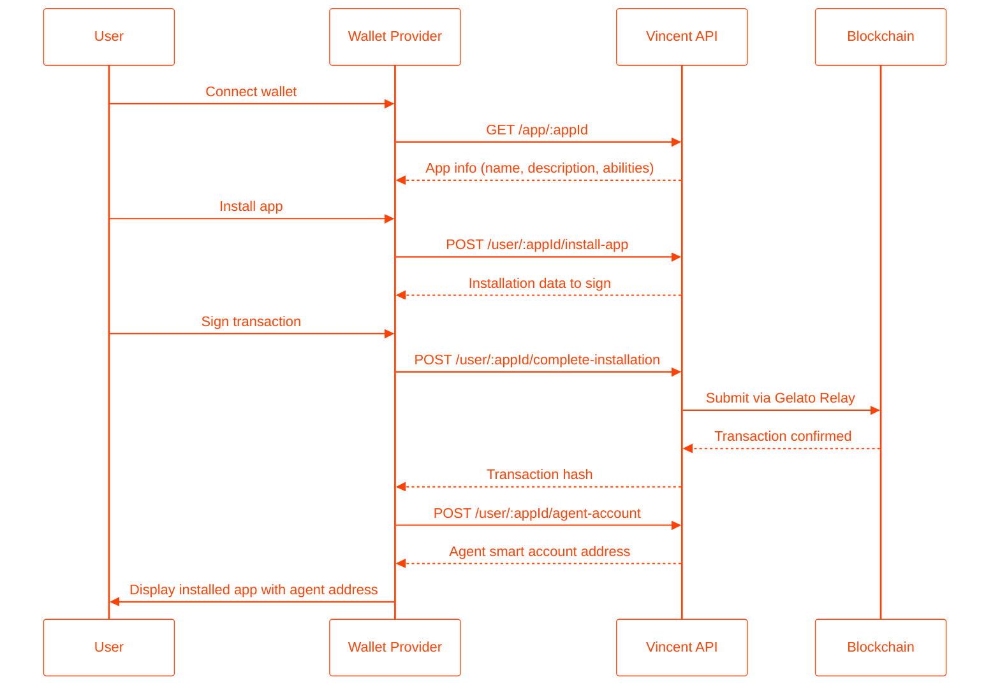

The Vincent API enables wallet providers to manage gasless app installations, query agent smart accounts, and handle permission flows for users. Through these endpoints, wallets can install apps on behalf of users, retrieve agent wallet addresses and token balances, and allow users to revoke or restore app permissions.

## Integration Flow Overview



## Available Endpoints

| Endpoint | Description |
|----------|-------------|
| [GET /app/:appId](/wallet-providers/get-app) | Fetch app details before installation |
| [POST /user/:appId/install-app](/wallet-providers/install-app) | Initiate app installation (also handles re-enabling unpermitted apps) |
| [POST /user/:appId/complete-installation](/wallet-providers/complete-installation) | Complete installation with signature |
| [POST /user/:appId/agent-account](/wallet-providers/agent-account) | Get user's agent smart account address |
| [POST /user/:appId/agent-funds](/wallet-providers/agent-funds) | Get token balances for agent account |
| [POST /user/:appId/unpermit-app](/wallet-providers/unpermit-app) | Initiate permission revocation |
| [POST /user/:appId/complete-unpermit](/wallet-providers/complete-unpermit) | Complete permission revocation |

## Smart Account Index Derivation

Each app installation creates a unique smart account address derived from the user's wallet address and the app ID. This ensures:

- **Deterministic addresses**: The same user + app combination always produces the same agent address
- **App isolation**: Each app gets its own dedicated smart account
- **Consistent lookup**: Wallet providers can reliably query agent addresses

The index is derived using: `keccak256("vincent_app_id_{appId}")`

To derive the address client-side (for verification):

```typescript
import { getKernelAddressFromECDSA } from '@zerodev/ecdsa-validator';
import { constants } from '@zerodev/sdk';
import { deriveSmartAccountIndex } from '@lit-protocol/vincent-contracts-sdk';

const agentAddress = await getKernelAddressFromECDSA({
  publicClient,
  eoaAddress: userWalletAddress,
  index: deriveSmartAccountIndex(appId),
  entryPoint: constants.getEntryPoint('0.7'),
  kernelVersion: constants.KERNEL_V3_1,
});
```
