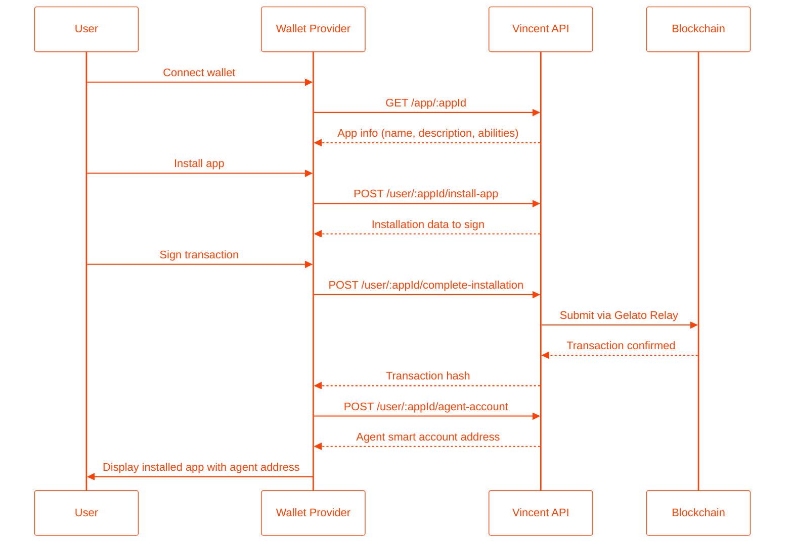

This guide explains how wallet providers can integrate with the Vincent API to display and manage user app installations. By following this flow, wallet providers can show users their installed Vincent apps and the associated smart account addresses.

## Integration Flow Overview

<div align="center">



</div>

## API Endpoints

### 1. Fetch App Information

Before installing an app, fetch its details to display to the user.

**Endpoint:** `GET /app/:appId`

<Tabs>
  <Tab title="Response">
    ```json
    {
      "appId": 123,
      "name": "DCA Trading Bot",
      "description": "Automated dollar-cost averaging for your portfolio",
      "contactEmail": "support@example.com",
      "appUrl": "https://example.com/app",
      "logo": "https://example.com/logo.png",
      "activeVersion": 1,
      "manager": "0x1234...5678"
    }
    ```
  </Tab>
  <Tab title="Usage">
    ```typescript
    const response = await fetch(`https://api.heyvincent.ai/app/${appId}`);
    const appInfo = await response.json();

    // Display app info to user before installation
    console.log(`App: ${appInfo.name}`);
    console.log(`Description: ${appInfo.description}`);
    ```
  </Tab>
</Tabs>

### 2. Initiate App Installation

Start the installation process by providing the user's wallet address.

**Endpoint:** `POST /user/:appId/install-app`

<Tabs>
  <Tab title="Request">
    ```json
    {
      "userControllerAddress": "0xUserWalletAddress..."
    }
    ```
  </Tab>
  <Tab title="Response">
    ```json
    {
      "agentSignerAddress": "0xPKPAddress...",
      "agentSmartAccountAddress": "0xSmartAccountAddress...",
      "appInstallationDataToSign": {
        "typedData": {
          "domain": { ... },
          "types": { ... },
          "message": { ... }
        }
      }
    }
    ```
  </Tab>
  <Tab title="Usage">
    ```typescript
    const response = await fetch(`https://api.heyvincent.ai/user/${appId}/install-app`, {
      method: 'POST',
      headers: { 'Content-Type': 'application/json' },
      body: JSON.stringify({
        userControllerAddress: userWallet.address
      })
    });

    const installData = await response.json();
    ```
  </Tab>
</Tabs>

### 3. Complete Installation with Signature

Have the user sign the typed data and submit it to complete the installation.

**Endpoint:** `POST /user/:appId/complete-installation`

<Tabs>
  <Tab title="Request">
    ```json
    {
      "typedDataSignature": "0xSignature...",
      "appInstallationDataToSign": { ... }
    }
    ```
  </Tab>
  <Tab title="Response">
    ```json
    {
      "transactionHash": "0xTransactionHash..."
    }
    ```
  </Tab>
  <Tab title="Usage">
    ```typescript
    // Sign the typed data with the user's wallet
    const { typedData } = installData.appInstallationDataToSign;
    const { EIP712Domain, ...types } = typedData.types;

    const signature = await userWallet._signTypedData(
      typedData.domain,
      types,
      typedData.message
    );

    // Complete the installation
    const response = await fetch(`https://api.heyvincent.ai/user/${appId}/complete-installation`, {
      method: 'POST',
      headers: { 'Content-Type': 'application/json' },
      body: JSON.stringify({
        typedDataSignature: signature,
        appInstallationDataToSign: installData.appInstallationDataToSign
      })
    });

    const result = await response.json();
    console.log(`Installation tx: ${result.transactionHash}`);
    ```
  </Tab>
</Tabs>

### 4. Retrieve Agent Account Address

After installation (or on subsequent visits), retrieve the user's agent smart account address for a specific app.

**Endpoint:** `POST /user/:appId/agent-account`

<Tabs>
  <Tab title="Request">
    ```json
    {
      "userControllerAddress": "0xUserWalletAddress..."
    }
    ```
  </Tab>
  <Tab title="Response">
    **If the user has installed the app:**
    ```json
    {
      "agentAddress": "0xAgentSmartAccountAddress..."
    }
    ```

    **If the user has not installed the app:**
    ```json
    {
      "agentAddress": null
    }
    ```
  </Tab>
  <Tab title="Usage">
    ```typescript
    const response = await fetch(`https://api.heyvincent.ai/user/${appId}/agent-account`, {
      method: 'POST',
      headers: { 'Content-Type': 'application/json' },
      body: JSON.stringify({
        userControllerAddress: userWallet.address
      })
    });

    const { agentAddress } = await response.json();

    if (agentAddress) {
      console.log(`User has installed app. Agent address: ${agentAddress}`);
      // Display the agent address and any associated balances
    } else {
      console.log('User has not installed this app');
      // Show installation prompt
    }
    ```
  </Tab>
</Tabs>

## Smart Account Index Derivation

Each app installation creates a unique smart account address derived from the user's wallet address and the app ID. This ensures:

- **Deterministic addresses**: The same user + app combination always produces the same agent address
- **App isolation**: Each app gets its own dedicated smart account
- **Consistent lookup**: Wallet providers can reliably query agent addresses

The index is derived using: `keccak256("vincent_app_id_{appId}")`

To derive the address client-side (for verification):

```typescript
import { getKernelAddressFromECDSA } from '@zerodev/ecdsa-validator';
import { constants } from '@zerodev/sdk';
import { deriveSmartAccountIndex } from '@lit-protocol/vincent-contracts-sdk';

const agentAddress = await getKernelAddressFromECDSA({
  publicClient,
  eoaAddress: userWalletAddress,
  index: deriveSmartAccountIndex(appId),
  entryPoint: constants.getEntryPoint('0.7'),
  kernelVersion: constants.KERNEL_V3_1,
});
```