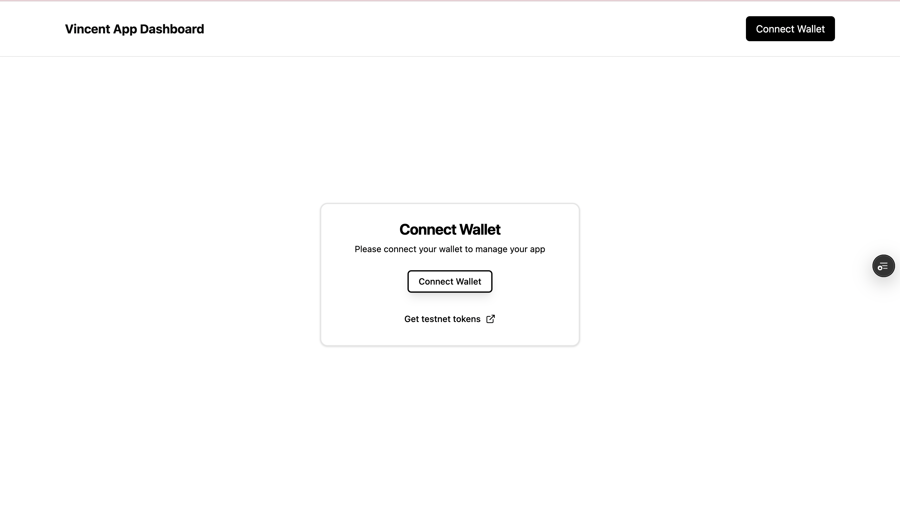
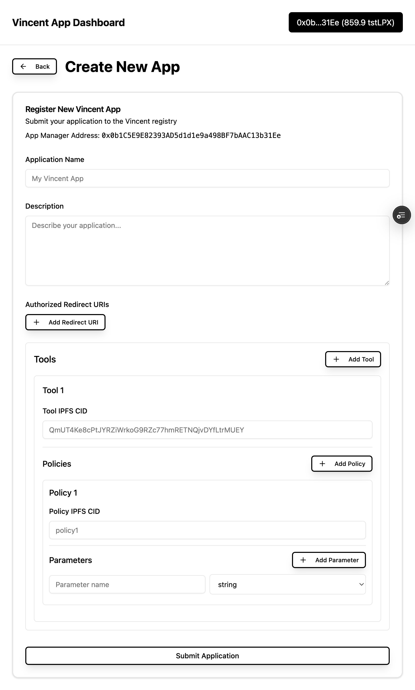
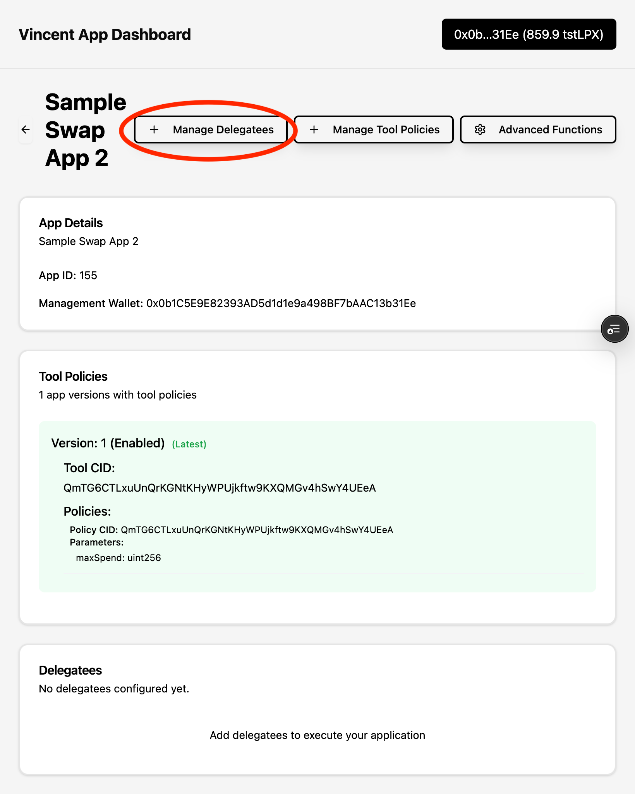

  

    Info Note
  

  
In this guide, you'll create and register your first Vincent App using the <a href="https://dashboard.heyvincent.ai/">Vincent App Dashboard</a>. You’ll select from existing Vincent Tools and Policies, configure your app metadata, and register Vincent App Delegatees authorized to act on behalf of your Vincent Users.

  
If you're unfamiliar with what a Vincent App is, checkout the <a href="./Getting-Started.md">Getting Started</a> guide to learn more.

# How a Vincent App Works

A Vincent App is composed of three key elements:

1. **Vincent Tools**: Modular, executable functions that define the operations your app can perform on behalf of its users. Tools can interact with blockchains, APIs, databases, or any service reachable via JavaScript and HTTP requests. Each Tool is immutable once published and can only be executed under the conditions explicitly approved by the user ensuring transparent, tamper-proof behavior.

2. **Vincent Policies**: Programmable guardrails that govern when and how Vincent Tools can be executed. Policies are immutable once published, and are configurable per user ensuring that every Tool execution is tightly scoped to each user’s explicit intent.

3. **Vincent Agent Wallets**: Non-custodial smart wallets that enable secure, automated interactions between your Vincent App and its users. Each Agent Wallet is powered by Lit Protocol's [Programmable Key Pairs (PKPs)](https://developer.litprotocol.com/user-wallets/pkps/overview), allowing users to retain full control over their keys and assets while delegating narrowly scoped signing permissions for each Vincent Tool used by a Vincent App.

# Defining Your Vincent App

Before registering your Vincent App, you’ll need to decide on the core components that make up its behavior and what policies your users will use to govern its execution.

## 1. Selecting Vincent Tools

Vincent Tools define the executable operations your app can perform on behalf of users such as swapping tokens, transferring assets, or querying APIs.

A Vincent Tool Registry that contains a list of all the available Vincent Tools and their associated Policies will be available soon.

  

    Info Note
  

  
Join the <a href="https://t.me/c/2038294753/3289">Vincent Community</a> to stay up to date.

For now you can select from the following Vincent Tools that have been published by the Vincent team:

<!-- TODO Get IPFS CIDs -->

| Tool                                                                                                                         | Description                                                                                                                                           | IPFS Cid |
| ---------------------------------------------------------------------------------------------------------------------------- | ----------------------------------------------------------------------------------------------------------------------------------------------------- | -------- |
| [ERC20 Token Approval](https://github.com/LIT-Protocol/Vincent/tree/main/packages/vincent-tools/vincent-tool-erc20-approval) | Allows Vincent Apps to get token approvals from Vincent Users to execute ERC20 token transfers                                                        | TBD      |
| [Uniswap Swap Tool](https://github.com/LIT-Protocol/Vincent/tree/main/packages/vincent-tools/vincent-tool-uniswap-swap)      | Allows Vincent Apps to perform swaps using Uniswap on any [chains supported by the Uniswap SDK](https://api-docs.uniswap.org/guides/supported_chains) | TBD      |

Alternatively, you can checkout the [Creating a Vincent Tool](../Tool-Developers/Creating-Tool.md) guide to learn how to create your own Vincent Tools to perform any on or off-chain action your Vincent App needs.

## 2. Selecting Vincent Policies

Vincent Policies are programmable constraints that govern when and how each Vincent Tool can be executed.

A Vincent Policy Registry that contains a list of all the available Vincent Policies will be available soon.

For now you can select from the following Vincent Policies that have been published by the Vincent team:

<!-- TODO Get IPFS CIDs -->

| Tool                                                                                                                           | Description                                                                                       | IPFS Cid |
| ------------------------------------------------------------------------------------------------------------------------------ | ------------------------------------------------------------------------------------------------- | -------- |
| [Daily Spending Limit](https://github.com/LIT-Protocol/Vincent/tree/main/packages/vincent-tools/vincent-policy-spending-limit) | Allows Vincent Users to restrict the amount of USD spent per day on their behalf by a Vincent App | TBD      |

Alternatively, you can checkout the [Creating a Vincent Policy](../Policy-Developers/Creating-Policy.md) guide to learn how to create your own Vincent Policies to govern the execution of your Vincent Tools.

## 3. Registering Your Vincent App

  

    Info Before registering your Vincent App
  

  
Registering an App requires that you have gas on Lit Protocol's Yellowstone blockchain. You can use <a href="https://chronicle-yellowstone-faucet.getlit.dev/">this faucet</a> to get the Lit test tokens used to pay for gas when registering your App.

Once you've selected your Vincent Tools and Policies, you'll need to register your Vincent App using the [Vincent App Dashboard](https://dashboard.heyvincent.ai/).

### Connecting your App Management Wallet to the App Dashboard

Before you can register your Vincent App, you'll need to connect an Ethereum wallet to the App Dashboard. This wallet will be the Vincent App Manager for your new app and is responsible for creating new App Versions, defining which Vincent Tools and Policies are used in each App Version, as well as the Vincent App Delegatees that are permitted to execute the Vincent Tools on behalf of your app's Vincent Users.

### Creating your App

After connecting your Vincent App Manager wallet to the App Dashboard, you can create a new App by clicking on the "Create New App" button:

On this screen you'll need to define the following:

1. **Application Name:** This is the name of your App that will be used to identify your app, and will be displayed to your Vincent Users when they interact with your app
2. **Description:** This description will be displayed to your Vincent Users when they interact with your app
3. **App Mode:** This defines the current deployment status of your app. Use:
   - `DEV` If you're currently developing the Vincent App and it's not ready to be used by your Vincent Users
   - `TEST` If you're currently testing the Vincent App with your Vincent Users, and want to make the distinction that your app is not yet ready for production
   - `PROD` If you're app have finished development and is ready to be used by your Vincent Users
4. **Authorized Redirect URIs:** This is the list of URLs that are authorized to receive the JWT from the Vincent Consent Page. This is the location where your users will be redirected to after they've logged in on the Vincent Consent Page
5. **Tools:** This section is where you'll define the IPFS CIDs of each Vincent Tool that will be used in your App.
   - **Policies:** Each Tool has Vincent Policies that can be enabled by the Vincent User to govern the execution of the Tool. This section is where you'll define the IPFS CIDs of each Vincent Policy that can be enabled by the Vincent User for the specific Tool it's associated with
   - **Policy Parameters:** Each Policy has parameters that can be configured by the Vincent User. This section is where you'll define the parameters for each Policy that can be configured by the Vincent User for the specific Tool it's associated with
     - **Policy Parameter Name:** This is the name of the parameter
     - **Policy Parameter Type:** This is the type of the parameter

After defining the above, you can click on the `Submit Application` button to create your App.

### Adding Delegatees to your App

After creating your app, you'll be redirected to the dashboard overview screen. Click the box with the name of the app you just created, and you'll be taken to the app's settings screen.

Next click the `Manage Delegatees` button to add the Vincent App Delegatees that can execute the selected Tools on behald of your Vincent Users:

