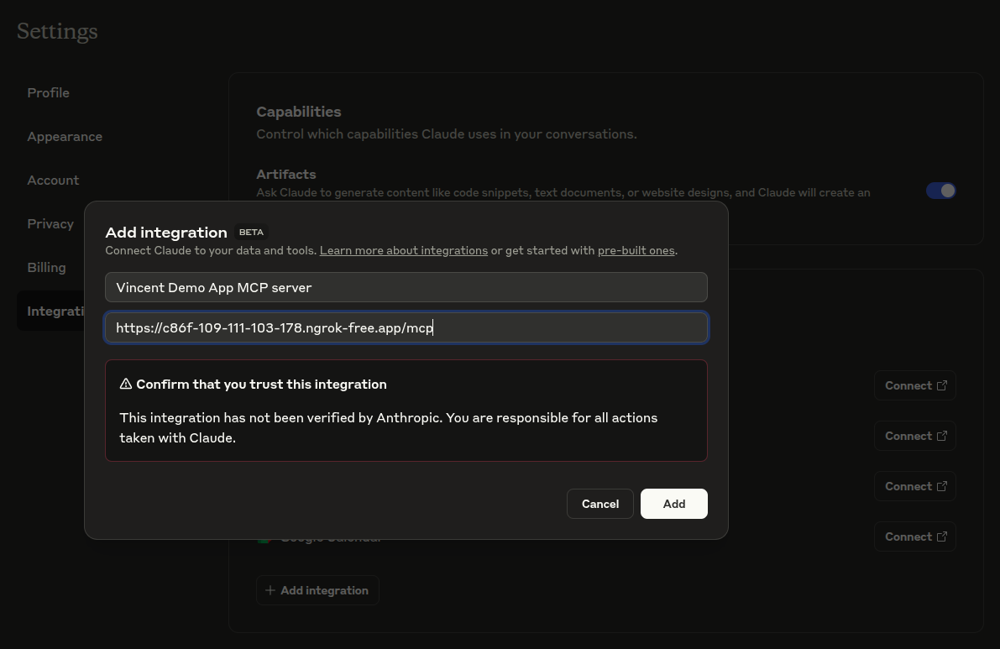
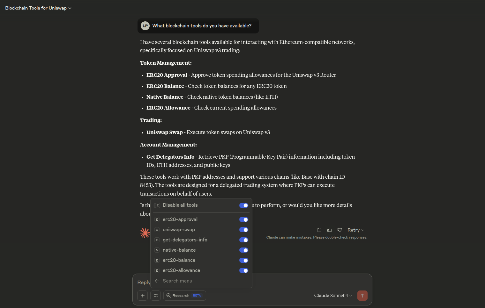

# MCP - Model Context Protocol

Any Vincent App can be converted into a Model Protocol Server (MCP) that can be consumed by any Large Language Model (LLM) that supports the MCP standard.

By following this process, your Vincent App tools will be exposed to LLMs as a set of MCP tools. The MCP server can be extended with custom tools and prompts to suit your specific needs.

And if you're building an AI application, check out our [OpenAI AgentKit demo](https://github.com/LIT-Protocol/Vincent-MCP-OpenAI-AgentKit) for a guide on how to integrate your Vincent App with the OpenAI AgentKit.

## Vincent App to MCP Server

The first step is to convert your Vincent App into an MCP server. This is done by using the `mcp.getVincentAppServer(...)` function from the `@lit-protocol/vincent-sdk` package.

```typescript
import { ethers } from 'ethers';
import { mcp } from '@lit-protocol/vincent-sdk';

// Create a signer using your Vincent App delegatee private key
const provider = new ethers.providers.JsonRpcProvider('https://mainnet.infura.io/v3/YOUR_INFURA_KEY');
const wallet = new ethers.Wallet('YOUR_PRIVATE_KEY', provider);

// Fill with your Vincent application data. Everything added here will be exposed to the LLM
const appDef: mcp.VincentAppDef = {
  id: '8462368',
  version: '1',
  name: 'My Vincent App',
  description: 'A Vincent application that executes tools for its delegators',
  tools: {
    'QmIpfsCid1': {
      name: 'myTool',
      description: 'A tool that does something',
      parameters: [
        {
          name: 'param1',
          type: 'string',
          description: 'A parameter that is used in the tool to do something'
        }
        // Add more parameters here
      ]
    },
    // Add more tools here
  }
};

// Create the MCP server. Next we will connect it to a transport to expose it to the LLM
const server = mcp.getVincentAppServer(wallet, appDef);
```

## Extending the MCP Server

At this moment you can add more tools, resources or prompts to the server.

```typescript
server.tool(...);
server.resource(...);
server.prompt(...);
```

These tools, resources and prompts will be exposed in the server along with the ones from the Vincent App definition. Consider adding any other tools that you want to be executed by the LLM and that are not Vincent Tools.


## Choosing a Transport

Next, you need to choose a transport mechanism to expose your MCP server to the LLM. The most common transports are `stdio` and `http`.

For examples on how to execute the server in different transports, check the [Vincent MCP package](https://github.com/LIT-Protocol/Vincent/tree/main/packages/mcp).

### STDIO Transport

```typescript
import { StdioServerTransport } from '@modelcontextprotocol/sdk/server/stdio.js';

// Connect the server to a transport (e.g., stdio for CLI-based LLM tools)
const stdioTransport = new StdioServerTransport();
await server.connect(stdioTransport);
```

In this case, the LLM client will execute this script to connect to the MCP server as a child process. Beware of polluting the `stdout` with logs, as it might break the JSON-RPC communication.

### HTTP Transport

```typescript
import { StreamableHTTPServerTransport } from '@modelcontextprotocol/sdk/server/streamableHttp.js';

// Connect the server to a transport (e.g., http for HTTP-based LLM tools)
const httpTransport = new StreamableHTTPServerTransport();
await server.connect(httpTransport);

// Finally in your API endpoint handler
await transport.handleRequest(req, res, req.body);
```

In this case, the LLM client will send a POST request to the API endpoint where you are exposing the MCP server. 

## Connecting to the LLM

Check your LLM Client documentation on how to connect to the MCP server with the transport you have chosen.

You can also check the [Vincent MCP package README](https://github.com/LIT-Protocol/Vincent/tree/main/packages/mcp) for examples on how to connect to the server with different modes.

## Executing Tools

When the LLM or Agent decides to execute a tool, it will send a request to the MCP server with the tool name and parameters. The MCP server will then execute the tool using the delegatee signer and return the result to the LLM.

# Integration with messaging APIs or LLM clients remotely

To integrate with either [OpenAI API](https://platform.openai.com/docs/guides/tools-remote-mcp) or [Anthropic API](https://docs.anthropic.com/en/docs/agents-and-tools/mcp-connector), or LLM clients that connect to public MCPs, you'll have to make your MCP server publicly accessible using the HTTP transport.

You can host your MCP server in any provider you want, such as [Heroku](https://www.heroku.com/) or [Render](https://render.com/).
Another option is using [ngrok](https://ngrok.com/) to expose your local process. Running `ngrok http 300` (adjusting the port if needed) will give you the public endpoint to reach your MCP.

When trying to connect to a messaging API, follow our [OpenAI](https://github.com/LIT-Protocol/Vincent/tree/main/packages/mcp/integrations/openAI.ts) or [Anthropic](https://github.com/LIT-Protocol/Vincent/tree/main/packages/mcp/integrations/anthropic.ts) examples for guidelines on how to use their messaging APIs with access to your MCP Server.

To connect with an LLM client remotely, such as [Anthropic Custom Integrations](https://support.anthropic.com/en/articles/11175166-about-custom-integrations-using-remote-mcp) insert your HTTP MCP server url as follows:


Ensure you are using the full endpoint, with the `/mcp` path if the client does not add that automatically.

Finally, activate the integration in your chat interface. Then you will have the Vincent Tools available in your LLM client.



# Integrating into OpenAI AgentKit

Check the [OpenAI AgentKit demo](https://github.com/LIT-Protocol/Vincent-MCP-OpenAI-AgentKit) for a guide on how to integrate your Vincent App with the OpenAI AgentKit.
