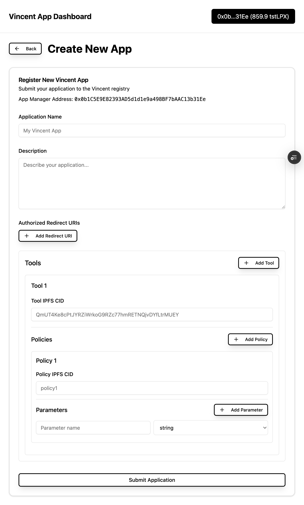

# Quick Start

<div class="info-box">
  <p class="info-box-title">
    <span class="info-icon">Info</span> Demo
  </p>
  <p>Try out the <a href="https://demo.heyvincent.ai/">Dollar-Cost-Averaging demo</a> that buys top memecoins on Base.</p>
  <p>You can follow the <a href="https://github.com/LIT-Protocol/vincent-dca/tree/main">end-to-end code</a> for the DCA demo.</p>
</div>

In this Quick Start guide you'll learn how to register your first Vincent app:

## 1. Creating Tools & Policies

- **Tools:** Vincent Tools are [Lit Actions](https://developer.litprotocol.com/sdk/serverless-signing/overview) that are used to define the specific operations that your Vincent app can perform on _behalf_ of your users. As a Vincent App developer, you can prompt your users to permit these Tools access to their Agent Wallet using the Vincent [Consent Page](../Users/Onboarding.md). This enables your application to perform these specific operations on behalf of the user, fully programmatically according to the guardrails they set via Policies.

- **Policies:** Users can set guardrails for the Tools they permit which dictate the operating conditions for that Tool. Each Tool can have any number of Policies associated with it, such as maximum daily spending limits or multi-factor authentication (MFA). The Vincent delegation system ensures that all of these policies are met before a given Tool can be executed using the delegated user's Agent Wallet. Just like Tools, Policies are also Lit Actions and your job as the app developer is to provide the the user with a set of optional Policies for each Tool using the Consent Page.

- **Policy Variables:** Each Policy can optionally have multiple Policy Vars. For example, max spend policy can have two vars: spend duration (hourly/daily/weekly) and max spend amount ($). These Policy Vars values are fully configurable by the user.

- **Writing your own Tools & Policies:** If none of the available Tool/Policies meet your needs you can [write your own Lit Actions](./Custom-Tools.md) that signs using the user's delegated wallet.

- **Selecting from existing Tool-Policy Registry:** You can select any of the following available Tools & their Policies to get quickly off the ground and register your Vincent App.

<div class="info-box">
  <p class="info-box-title">
    <span class="info-icon">Info</span> Note
  </p>
  <p>The Vincent Tool Registry will be published soon. Join the <a href="https://t.me/c/2038294753/4">Lit Builders Circle</a> to stay up to date.</p>
</div>

**Available Tools & Policies:**
| Tool | IPFS Cid |
|------|--------|
| ERC20 Token Approval | QmPZ46EiurxMb7DmE9McFyzHfg2B6ZGEERui2tnNNX7cky |
| Uniswap Tool | QmZbh52JYnutuFURnpwfywfiiHuFoJpqFyFzNiMtbiDNkK |

<br>

| Policy         | IPFS Cid                                       |
| -------------- | ---------------------------------------------- |
| Spending Limit | QmZrG2DFvVDgo3hZgpUn31TUgrHYfLQA2qEpAo3tnKmzhQ |

It's an ever expanding list and we're actively adding more Tools & Policies to the Registry.

**Note:** The DCA example uses both the ERC20 Token Approval Tool & the Uniswap Tool because the user's first need to approve the ERC20 tokens to be used by the Uniswap contracts. Then they can set a spending limit for the Uniswap Tool.

## 2. Registering an App using the App Dashboard

<div class="info-box">
  <p class="info-box-title">
    <span class="info-icon">Info</span> App Dashboard
  </p>
  <p>Please follow the below steps to register your App using the <a href="https://dashboard.heyvincent.ai/">Dashboard</a>.</p>
  <p>Registering an App requires that you have gas on our Yellowstone blockchain. You can use the <a href="https://chronicle-yellowstone-faucet.getlit.dev/">faucet</a> to get some tokens for registering your App.</p>
</div>

- **Management Wallet:** Once you've selected your Tools & Policies (IPFS Cids) head over to the App Dashboard where you need to connect your EOA wallet. This is your App management account which is used for adding Delegatees, registering Vincent Apps on-chain and publishing newer versions of your existing Vincent Apps.


- **Create New App:** After you logged in and have selected the Tools & Policies you want to register your App with, you can create a new App by clicking on the "Create New App" button.



- **Delegatees:** Delegatees are EOA wallets generated in the App Dashboard that are allowed to execute the permitted Tools on behalf of your users. You need to register these Delegatee addresses on-chain and the Tools check whether the executor matches the on-chain Delegatee registered for the App.


## 3. Using the Vincent SDK

<div class="info-box">
  <p class="info-box-title">
    <span class="info-icon">Info</span> Vincent SDK
  </p>
  <p>Please refer to the Vincent SDK API docs for a more comprehensive guide: <a href="https://sdk-docs.heyvincent.ai/">https://sdk-docs.heyvincent.ai/</a></p>
</div>

- **[Handle User Login](https://sdk-docs.heyvincent.ai/Vincent_Web_App/VincentWebAppClient.html#redirecttoconsentpage):** You can use the Vincent Consent Page to sign-in users to your App instead of implementing a separate User Login flow. You need to provide a redirectUri in the URLSearch params (`https://dashboard.heyvincent.ai/appId/160/consent?redirectUri=http://localhost:3000`) to receive the signed JWT from the user's Agent Wallet after they log in on the Vincent Consent Page. This can be used as the User's Auth for your App, for example, use it as the user's access token for your API requests.

- Install the Vincent SDK using NPM:

```bash
npm install @lit-protocol/vincent-sdk
```

```javascript
import { getVincentWebAppClient } from '@lit-protocol/vincent-sdk';

const vincentAppClient = getVincentWebAppClient({ appId: MY_APP_ID });

// ... In your app logic:
if (vincentAppClient.isLogin()) {
  // Handle app logic for the user has just logged in
  const { decoded, jwt } = vincentAppClient.decodeVincentLoginJWT(EXPECTED_AUDIENCE);
  // Store `jwt` for later usage; the user is now logged in.
} else {
  // Handle app logic for the user is already logged in (check for stored & unexpired JWT)
  // Handle app logic for the user is not yet logged in
  vincentAppClient.redirectToConsentPage({ redirectUri: window.location.href });
}
```

- **[Execute Tools for User's Wallet](https://sdk-docs.heyvincent.ai/Vincent_Tools/VincentToolClient.html#execute):** This is where you provide all your AI-Agentic logic in the `params` object of the `execute()` function, for example, the tokens to buy and at what price.

```javascript
import { getVincentToolClient } from '@lit-protocol/vincent-sdk';
import { bundledVincentTool as erc20BundledTool } from '@lit-protocol/vincent-tool-erc20-approval';

// One of delegatee signers from your app's Vincent Dashboard
const delegateeSigner = new ethers.Wallet('YOUR_DELEGATEE_PRIVATE_KEY');

// Initialize the Vincent Tool Client
const toolClient = getVincentToolClient({
  ethersSigner: delegateeSigner,
  bundledVincentTool: erc20BundledTool,
});
const delegatorPkpEthAddress = '0x09182301238'; // The delegator PKP Eth Address

const toolParams = {
  chainId: '8453', // The chain where the tx will be executed
  tokenIn: '0x1234...', // The ERC20 token address
  amountIn: '1000000000000000000', // The amount to approve (in wei)
  rpcUrl: 'https://mainnet.base.org', // The RPC to send the transaction through
};

// Run precheck to see if tool should be executed
const precheckResult = await client.precheck(toolParams, {
  delegatorPkpEthAddress,
});

if (precheckResult.success === true) {
  // Execute the Vincent Tool
  const executeResult = await client.execute(toolParams, {
    delegatorPkpEthAddress,
  });

  // ...tool has executed, you can check `executeResult` for details
}
```
